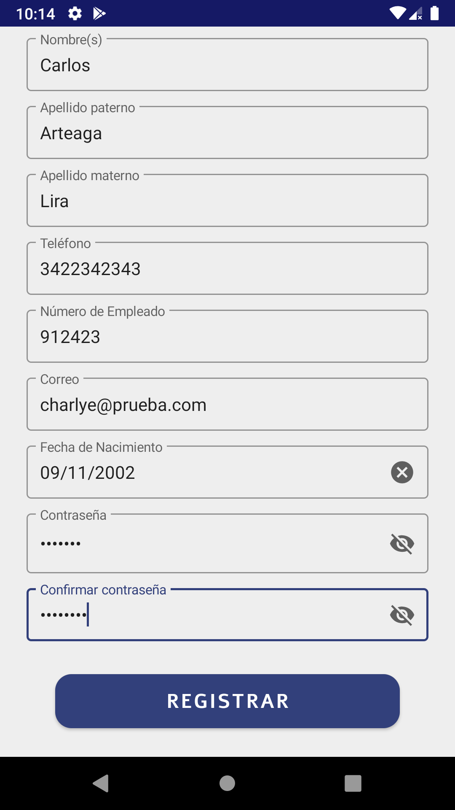

# EmpresasAppANDCMAL

Proyecto en android encagado de simular una app empresarial, la cual registrara la asistencia de un empleado mediante una fotografia comparando las coordenadas de donde fue tomada, con las de la locacion de la empresa, ademas de contar con sus respectivo login, formulario de registro, cambio de contraseña, lectura de noficaciones y levantamiento de reportes empleando una arquitectura MVP.

## Video del funcionamiento de la app
https://www.youtube.com/watch?v=ATmdUWaed4Y&t=49s

## Capturas de ejemplo

